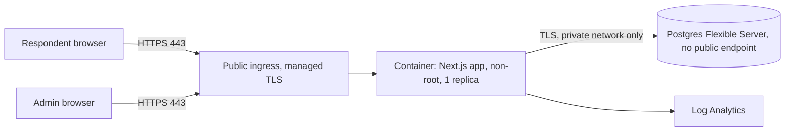

# Provider survey app: what we need from IT

This describes a working proof of concept (POC), what it already does for security, and what we need IT to provide to run it in production. The POC is in this repo and can be deployed to Azure with one script. It is a concrete starting point to review, and it is open to changes.

## 1. What it is

A small web app (Next.js in a container, Postgres database) used to run provider surveys.

- **Respondents** (outside organizations) open one generic link, enter their organization name, and get a unique link. That unique link is their only credential. They use it to save, come back, and submit. No accounts, no passwords, no email from the server.
- **Administrators** (internal staff) sign in to a separate page to see progress, export results to CSV, and recover respondents who lost their link.

**Data sensitivity.** Respondents enter organization-level financial figures: average wages paid by staff type, net revenue, and net income. This is commercially sensitive. It is not personal data about individuals, apart from the organization name a respondent types. We would like IT to confirm the data classification and whether any regulatory framework applies (see section 8).

## 2. Architecture

POC resources (all Azure, one resource group, defined in Terraform in `infra/`): Container Apps environment and app, Postgres Flexible Server (private access), container registry, virtual network with two subnets, private DNS zone, Log Analytics workspace, managed identity.

## 3. What we need from IT

| # | Need | Why | In the POC |
|---|------|-----|-----------|
| 1 | A place to run one container (Container Apps, App Service, AKS, or an existing standard) | Runs the app | Azure Container Apps |
| 2 | Inbound HTTPS 443 from the internet to that container only. HTTP 80 redirect to 443 | Respondents are external | Platform ingress, HTTP redirected |
| 3 | A DNS name and TLS certificate on an organization domain (for example survey.example.org) | Trust. Respondents should see our domain, not a cloud hostname | Free azurecontainerapps.io hostname, platform-managed cert |
| 4 | Postgres 16 with no public endpoint, TLS required, encryption at rest, backups | Stores responses | Flexible Server, private access, 7 day backups |
| 5 | A secret store for the app's secrets (database URL with its password, data encryption key, admin password hash, session secret) | The app needs them at start | Container Apps secrets. Terraform generates all except the admin password hash, which the deployer supplies |
| 6 | Admin sign-in through our identity provider (Entra ID SSO) instead of the built-in shared password | Individual accountability, MFA, offboarding | Built-in single shared password (POC only) |
| 7 | Log retention, plus a way to read the app's audit table or ship it to a SIEM | Incident response | 30 days of container logs in Log Analytics. The app's admin page shows the latest 200 audit events. The full table sits in the private database |
| 8 | Backup and restore policy for the database, and a decision on retention of responses | Data lifecycle | 7 day platform backups, no restore tested |
| 9 | Optional: WAF or gateway in front, with request size limits and shared rate limiting | Defense in depth, and lets us run more than one replica | None |
| 10 | Image build, scanning and patching process for the container | Supply chain | CI scans an image built from each PR. The deployed image is built on the deployer's machine by `up.ps1`, from an unpinned `node:24-alpine` base, so it is not the exact image CI scanned |
| 11 | A least-privilege database role for the app (data changes only), with separate credentials for schema changes | Limits the damage from an app bug or injection | None. The app connects as the Postgres server admin account |

## 4. Security controls

| Control | How | Provided by | Status |
|---------|-----|-------------|--------|
| TLS in transit, HTTP redirected, HSTS | Platform ingress plus HSTS header | Platform, app | In POC |
| Database not reachable from the internet | Private subnet, no public endpoint, private DNS | Platform | In POC |
| Encryption at rest | Azure-managed on the database, plus app-level AES-256-GCM on every answer | Platform, app | In POC |
| Respondent credential strength | 256-bit random token, only its SHA-256 hash is stored | App | In POC |
| Credential kept out of logs | Token travels in the URL fragment and an Authorization header, never in the URL path or query | App | In POC |
| No enumeration of valid links | Wrong, expired, and revoked tokens return the same 404. Failed lookups are rate limited | App | In POC |
| Submitted responses cannot change, nothing is deleted | Update statements only match in-progress rows, a CHECK constraint, and database triggers that reject edits to submitted rows, un-revoking, deleting responses, and changing or deleting audit rows | App | In POC (a database administrator can still drop the triggers) |
| Answers cannot be moved between records | Ciphertext is bound to its record id | App | In POC |
| Input validation | Schema validation on every endpoint, unknown fields rejected, 20 KB body limit (declared size checked first, then actual bytes) | App | In POC |
| Security headers | CSP, X-Content-Type-Options, Referrer-Policy no-referrer, Permissions-Policy, frame-ancestors none, no-store caching | App | In POC (CSP allows inline scripts, see section 6) |
| Admin authentication | Scrypt password hash, constant-time compare, per-IP and global login limits, signed HttpOnly SameSite=Strict cookie, 4 hour expiry | App | In POC, to be replaced by SSO |
| Admin CSRF protection | SameSite=Strict plus same-origin check on every state-changing request | App | In POC |
| Spreadsheet injection in export | Cells beginning with = + - @ are neutralized | App | In POC |
| Audit trail | Append-only table records created, saved, submitted, admin login, failed login, reissue, revoke, export. Never holds answers or tokens. Latest 200 events visible on the admin page | App | In POC |
| No destructive edits | Revoke and reissue change state and keep the row. Nothing is deleted | App | In POC |
| Secrets not in source control | Generated at deploy time, held in platform secrets and local Terraform state | Platform, process | In POC |
| Container hardening | Non-root user, npm and corepack removed from the runtime image, health probes | App | In POC |
| Dependency and image scanning | CI runs npm audit and Trivy on an image built from every PR, Dependabot weekly | Process | In POC (see need 10 for the deployed image) |
| Least privilege to pull images | Managed identity with AcrPull, registry admin user disabled | Platform | In POC |

## 5. How the credential works (and its limits)

The unique link is a bearer secret. Anyone who has it can read and change that response until it is submitted. We accept this on purpose to avoid accounts and server-sent email, and we reduce the risk of loss and sharing as follows.

- The link is shown once, with Copy, Download, and "Email to myself" buttons. The last one opens the respondent's own mail client, so the server never sees their address.
- The browser remembers the link on the same device so respondents can resume from the home page.
- If a link is lost, an administrator can issue a new one after confirming the respondent's identity by phone or email. The old link stops working immediately.
- Links expire 90 days after the response is created, no matter how recently it was saved. Expiry only blocks access. Reissuing a link restarts the 90 days. Nothing is purged, so expired rows and their ciphertext stay in the database until a database administrator removes them (the delete-guard trigger has to be dropped first). Administrators can revoke a link.
- The browser's localStorage also holds the link on that device. Combined with the inline-script allowance in the CSP (gap 4), a script injection bug could read it.

Downsides: forwarding a link forwards access, a shared computer can expose it, and recovery relies on a manual identity check against a self-reported organization name. These are documented in `docs/adr/0002-token-link-credential.md`.

## 6. Known gaps in the POC (what production would add)

1. **Admin SSO and roles.** One shared password today. Stateless sessions cannot be revoked before they expire (4 hours). The audit table records no user identity or IP address, and a database administrator could edit it.
2. **Rate limiting is in memory, in one process.** The app must run as exactly one replica. Production needs gateway-level or shared rate limiting before scaling out. The app trusts the last X-Forwarded-For entry, which is only correct behind exactly one proxy. That has not been checked against the live Container Apps ingress. Counters also reset on every restart or deploy.
3. **Database certificate is not verified.** The connection is encrypted over a private network, but the server certificate is not checked. Production should verify it against the Azure CA bundle.
4. **CSP allows inline scripts.** Next.js needs them for hydration. A nonce-based policy is planned.
5. **Container Apps has no read-only root filesystem option.** Local compose enforces one. Another platform (AKS) could enforce it.
6. **Request size is limited inside the app only.** Oversized requests are rejected by declared length, but a body can still be streamed to the app first. A gateway or WAF should cap request size.
7. **No tested restore.** Backups exist at the platform level. Restore has not been exercised.
8. **Immutability guards can be removed by the database admin.** The triggers that protect submitted and revoked rows, and the audit table, are in the schema, and the app's database account (gap 12) has the rights to drop them.
9. **Secrets sit next to the data they protect.** Terraform state on the deployer's machine holds the data encryption key, database password and session secret in plain text, and the platform secret store holds the same values. Anyone who can read either can decrypt the answers, so app-level encryption mainly protects against a database-only leak. Production needs a remote, locked, access-controlled state backend, and ideally a key held in a vault that the database administrators cannot read.
10. **No survey builder, multi-survey support, or voiding a submitted response.** One demo survey is defined in code.
11. **Hard 90 day expiry.** A link expires 90 days after creation. Reissuing a link restarts the 90 days, but there is no other way to extend it and a survey that runs longer needs a code change. Nothing purges expired data.
12. **The app uses the database admin account.** There is no separate least-privilege role (need 11).
13. **Audit viewer is minimal.** The admin page shows the latest 200 events with no filtering, no user identity (one shared admin), and no IP address. Shipping rows to a SIEM needs private database access.
14. **No penetration test or formal threat review.** The checks done so far are code review and live testing of the flows.

## 7. Threats considered

| Threat | Mitigation | Residual risk |
|--------|-----------|---------------|
| Someone guesses a respondent link | 256-bit random token, hashed at rest, rate limited | Negligible |
| Database leak | Tokens hashed, answers encrypted with a key held outside the database | Leak plus key theft exposes data |
| Link leaks through logs, history, referrers | Fragment-based token, no-referrer policy, no-store caching | Browser history and shared computers |
| Respondent forwards or loses link | Reissue and revoke, expiry | Human behavior |
| Admin password guessing | Scrypt, rate limits, global limit | A determined attacker can lock the admin out for 10 minutes |
| Cross-site request forgery on admin | SameSite=Strict plus origin check | Low |
| Injection (SQL, CSV formula, XSS) | Parameterized queries, schema validation, CSV neutralization, CSP, React escaping | Low |
| Bot or abuse of the start endpoint | 10 starts per hour per IP | Distributed abuse is not stopped without a WAF |
| Compromised dependency or image | Scanning in CI, minimal image, Dependabot | Zero-days |
| Insider with portal access | Platform RBAC (not designed in the POC) | Depends on IT access model |

## 8. Questions IT is likely to ask

- **What is the data classification, and does any regulation apply?** Organization-level financial figures. Not personal or health data as designed. Please confirm with Compliance. The organization name is stored in plain text so administrators can find a response.
- **Why not user accounts?** To avoid collecting and securing credentials and email addresses for a short survey, and to avoid server-sent email. We accept the bearer-link tradeoffs in section 5. If IT requires accounts, the data model and API are small enough to change.
- **Where is data stored and for how long?** In one Postgres database in the chosen Azure region. Links expire after 90 days. We need a retention decision from the business.
- **Who can see responses?** Anyone with admin access, and platform administrators with database and key access. The encryption key is in the platform secret store, so a platform administrator can read it.
- **Can we put this behind our WAF or API gateway?** Yes. The app is a normal HTTPS container. Doing so would remove gaps 2 and 6.
- **Can it run on our existing platform?** Yes. It needs one container, a Postgres 16 database, a few secrets (see need 5), and HTTPS ingress. Nothing in the app is Azure-specific. The Terraform is.
- **What happens when it is deleted?** `./scripts/down.ps1` destroys the database, the key, and everything else in the POC. Production would need an agreed retention and deletion process.

## 9. If IT cannot deliver in time

The same repo can host a real survey in our own Azure subscription:

Prerequisites: a laptop with Azure CLI, Terraform, Docker and Node; rights in the Azure subscription to create resources, role assignments and register resource providers; someone who owns the subscription and its cost (it bills hourly while it exists); and a plan for a custom domain, since the POC uses the free Azure hostname.

1. Deploy with `./scripts/up.ps1` and note the URL.
2. Restrict access with `-AllowedIp` while testing. To open it to the public, re-run `up.ps1` without that flag.
3. Keep the Terraform state file (`infra/terraform.tfstate`) safe. Losing it makes a clean teardown harder (`down.ps1` falls back to deleting the resource group).
4. Export the CSV from the admin page, and run `./scripts/down.ps1` when the survey closes.

Before using it for a real survey, close the gaps that matter most: admin access (1), database certificate verification (3), a tested backup (7), the 90 day expiry (11), and a custom domain (need 3). Share this document and the repo with IT so they can review it in parallel.

## 10. What was verified on a live deployment

The POC was deployed to Azure (East US 2) on 2026-10-01 with `up.ps1`, tested, then destroyed with `down.ps1`.

- HTTPS works on the Azure hostname. HTTP returns a 301 redirect to HTTPS.
- The security headers listed in section 4, including HSTS, were present on responses from the live app.
- The full respondent flow worked end to end: start, save, resume, submit, and a rejected edit after submit. Admin sign-in, list, CSV export, and audit events worked. Unauthenticated admin calls returned 401, and a bad respondent token returned 404.
- The database reports public network access disabled, sits on a delegated private subnet, and its hostname does not resolve from the public internet.
- The container app ran as exactly one replica, took all four secrets from platform secrets (none appear in its environment settings), and the registry admin user was off.
- The container logs held no answers, organization names, or passwords.
- After `down.ps1`, the subscription's resource groups and resource count matched what they were before the deploy, with no leftover managed resource groups or soft-deleted workspaces.

Not verified live: the database contents (checked only locally), certificate details beyond the platform default, how the Container Apps ingress sets X-Forwarded-For (the rate limiter depends on it, see gap 2), behavior under load, and a restore from backup.

## 11. Reference

- Respondent endpoints: `POST /api/responses`, `GET` and `PUT /api/responses/me`, `POST /api/responses/me/submit`
- Admin: `/admin`, `/api/admin/*`
- Health check: `GET /healthz` (returns `{"status":"ok"}`, touches nothing)
- Required settings: `DATABASE_URL`, `DATA_ENCRYPTION_KEY` (32 random bytes, base64), `ADMIN_PASSWORD_HASH`, `ADMIN_SESSION_SECRET`
- Ports: inbound 443 (and 80 for redirect). The app listens on 3000 inside the platform. Outbound: app to Postgres 5432 on the private network, registry pull at deploy.
